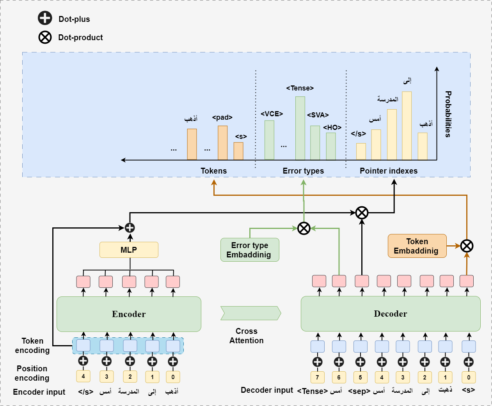

# MTAGEC
**MTAGEC** is a multi-task framework for Arabic Grammatical Error Correction (AGEC) that performs:
- Error correction
- Error-type classification
- Explanation (rationale) evidence word extraction

Trained on **ExplAGEC**: the largest synthetic dataset for explainable AGEC, with 21.8M sentence pairs and 25 error types.

<p align="center">
  
  <br>
  <i>MTAGEC architecture: multi-task transformer for correction, error-type classification, and evidence extraction</i>
</p>

## Features

- **AEEG**: Synthetic error generation based on error taxonomy ([Belkebir & Habash 2021](https://doi.org/10.18653/v1/2021.conll-1.47))
- **Unified Transformer**: Joint sequence generation for correction + explanation
- **Benchmarks**: QALB-2014, QALB-2015 support
- **State-of-the-art**: Achieves F0.5 = 80.02 (QALB-2014), F0.5 = 81.73 (QALB-2015)

## Quick Start

### 1. Clone the repo
```bash
git clone https://github.com/Zainabobied/MTAGEC.git
cd MTAGEC
```

### 2. Install dependencies
```bash
pip install -r requirements.txt
```

### 3. Generate synthetic data
```bash
# Generate synthetic data using AEEG
python scripts/generate_dataset.py --input data/raw/arabic_wikipedia.txt --output data/explagec/explagec_full.json --error-rate 0.1
```

### 4. Preprocess data
```bash
# Preprocess ExplAGEC data
python scripts/preprocess.py --config config/config.yaml --explagec

# Preprocess QALB data
python scripts/preprocess.py --config config/config.yaml --qalb --qalb-dataset qalb2014
python scripts/preprocess.py --config config/config.yaml --qalb --qalb-dataset qalb2015
```

### 5. Train the model
```bash
# Train MTAGEC model
python scripts/train_mtagec.py --config config/config.yaml
```

### 6. Evaluate the model
```bash
# Evaluate on ExplAGEC test set
python scripts/evaluate.py --config config/config.yaml --model_path models/checkpoints/mtagec_transformer/checkpoint-epoch-X --explagec

# Evaluate on QALB-2014 test set
python scripts/evaluate.py --config config/config.yaml --model_path models/checkpoints/mtagec_transformer/checkpoint-epoch-X --qalb2014

# Evaluate on QALB-2015 test set
python scripts/evaluate.py --config config/config.yaml --model_path models/checkpoints/mtagec_transformer/checkpoint-epoch-X --qalb2015
```

## Project Structure

```
MTAGEC/
├── config/                 # Configuration files
│   └── config.yaml         # Main configuration
├── data/                   # Data directory
│   ├── explagec/           # ExplAGEC synthetic dataset
│   ├── processed/          # Processed datasets
│   ├── qalb/               # QALB benchmark datasets
│   └── raw/                # Raw data for synthetic generation
├── models/                 # Model implementations
│   ├── checkpoints/        # Saved model checkpoints
│   └── mtagec_transformer.py  # MTAGEC model implementation
├── scripts/                # Scripts for data processing and training
│   ├── evaluate.py         # Evaluation script
│   ├── generate_dataset.py # Synthetic data generation
│   ├── preprocess.py       # Data preprocessing
│   ├── train_mtagec.py     # Model training
│   └── utils.py            # Utility functions
├── LICENSE                 # License file
├── README.md               # This README
└── requirements.txt        # Python dependencies
```

## Data

### ExplAGEC Dataset

The ExplAGEC dataset is generated using the Arabic Explainable Error Generator (AEEG), which introduces 25 types of linguistic errors:

1. **Orthographic errors**: Alif/Ya confusion, Hamza confusion, Ta/Ha confusion, etc.
2. **Morphological errors**: Definite article misuse, Gender agreement, Number agreement, etc.
3. **Semantic errors**: Confusion in conjunction, Incorrect word choice
4. **Punctuation errors**: Punctuation replacement, deletion, insertion
5. **Merge/Split errors**: Word merging, Extra space

### QALB Benchmarks

The QALB-2014 and QALB-2015 benchmarks are used for evaluation. These datasets contain authentic Arabic text with grammatical errors and their corrections.

## Model

MTAGEC is based on Transformer encoder-decoder architecture with a unified softmax layer that combines:

1. **Vocabulary tokens**: For generating corrected text
2. **Pointer indices**: For extracting evidence from the input
3. **Error type labels**: For classifying the type of error

The model supports different training configurations:
- **Baseline**: Standard GEC (correction only)
- **Infusion**: GEC with explanation as auxiliary input
- **Explanation-only**: Error type classification and evidence extraction
- **Self-Rationalization**: Joint correction and explanation generation

## Citation

If you use MTAGEC in your research, please cite our paper:

```bibtex
@article{mahmoud2023mtagec,
  title={MTAGEC: Multi-Task Arabic Grammatical Error Correction as a sequence generation with Synthetic data},
  author={Mahmoud, Zeinab and Li, Chunlin and Zappatore, Marco and Alfatemi, Ali and Solyman, Aiman},
  journal={arXiv preprint},
  year={2023}
}
```

## License

This project is licensed under the MIT License - see the [LICENSE](LICENSE) file for details.
